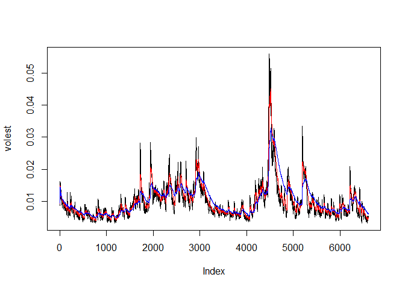

# SP500
Emmanuel Farrugia  
March 27, 2017  

## Downloading S&P500 Data, calculate log returns, volatility and plot Volatility Decay

### Time Series Package.

Install 'tseries' package and load library. The 'tseries' is a package for time series analysis and computational finance. For more details on using it see, <https://cran.r-project.org/web/packages/tseries/index.html>.
 

```r
#install.packages("tseries")
library(tseries)
```

```
## Warning: package 'tseries' was built under R version 3.3.3
```
### Download S&P500 Time Series Close Price Data.


```r
SNPdata <- get.hist.quote(instrument ='^GSPC',quote="Close")
```

```
## time series ends   2017-03-24
```
### Calcualate the log returns. 


```r
SNPret <- log(lag(SNPdata)) - log(SNPdata)
```

### Caculate the annualized volatility.


```r
SNPvol <- sd(SNPret)* sqrt(250)*  100
```
### Define decay factor function.


```r
getVol <- function(d, logrets) {
	var = 0
	lam = 0
	varlist <- c()

	for (r in logrets) {
		lam = lam*(1 - 1/d) + 1
	  var = (1 - 1/lam)*var + (1/lam)*r^2
		varlist <- c(varlist, var)
	}

	sqrt(varlist)
}
```

### Calculate the decay factors, 10, 30 and 100.


```r
volest <- getVol(10,SNPret)
volest2 <- getVol(30,SNPret)
volest3 <- getVol(100,SNPret)
```
### Plot Decay factors and volatilites.


```r
plot(volest,type="l")
lines(volest2,type="l",col="red")
lines(volest3, type = "l", col="blue")
```

<!-- -->

